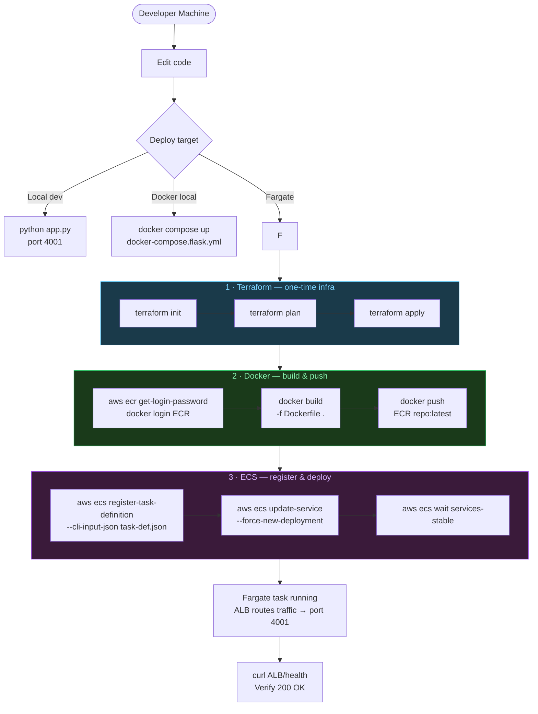

# AWS CLI Deployment Guide — Flask FHIR Demo on Fargate

## Infrastructure Overview

| Resource | Value |
|---|---|
| AWS Account | `005905648819` |
| Region | `us-east-1` |
| ECR repository | `005905648819.dkr.ecr.us-east-1.amazonaws.com/sorrentino-fargate-fhir-demo-repo:latest` |
| ECS cluster | `sorrentino-fargate-fhir-demo-cluster` |
| ECS service | `sorrentino-fargate-fhir-demo-service` |
| Task definition family | `flask-dynamo-db-backend` |
| Task IAM role | `ecs-fargate-cluster-task-role` |
| Execution IAM role | `ecsTaskExecutionRole` |
| ALB DNS | `sorrentino-fargate-fhir-demo-alb-1996236158.us-east-1.elb.amazonaws.com` |
| CloudWatch log group | `/ecs/flask-dynamo-db-backend` |
| Container port | `4001` |
| Task CPU / Memory | `512` vCPU units / `1024` MB |

---

## Deployment Flow



---

## Step 0 — Prerequisites

```bash
# Verify AWS credentials
aws sts get-caller-identity

# Expected output
# {
#   "Account": "005905648819",
#   "UserId": "...",
#   "Arn": "arn:aws:iam::005905648819:..."
# }

# All commands below run from the project root
```

---

## Step 1 — Terraform (one-time infrastructure)

Terraform provisions: VPC, subnets, ALB, target group, ECS cluster, ECS service,
ECR repository, IAM roles, security groups, CloudWatch log group.

```bash
cd infra/terraform/flask-fargate-ecs

# Initialise providers and backend
terraform init

# Preview changes (no resources created yet)
terraform plan -var-file=terraform.tfvars

# Apply — creates all AWS resources
terraform apply -var-file=terraform.tfvars

# Capture outputs needed for later steps
terraform output ecr_repository_url
terraform output ecs_cluster_name
terraform output ecs_service_name
terraform output alb_dns_name
```

> **Re-running Terraform** on an existing stack is safe — it only applies diffs.
> To destroy all resources: `terraform destroy -var-file=terraform.tfvars`

### CI/CD pipeline (optional)

```bash
cd infra/terraform/flask-fargate-pipeline

terraform init
terraform apply -var-file=terraform.tfvars
# Creates CodePipeline + CodeBuild for automated deploys on git push
```

---

## Step 2 — Docker: Build & Push to ECR

Run from the project root (the Dockerfile is a multi-stage build that includes the
React frontend and the Flask backend).

```bash
# 2a. Authenticate Docker to ECR
aws ecr get-login-password --region us-east-1 \
  | docker login --username AWS --password-stdin \
    005905648819.dkr.ecr.us-east-1.amazonaws.com

# 2b. Build the image (multi-stage: React → Flask/gunicorn)
docker build \
  -f flask-dynamo-db-backend/Dockerfile \
  -t 005905648819.dkr.ecr.us-east-1.amazonaws.com/sorrentino-fargate-fhir-demo-repo:latest \
  .

# 2c. Push to ECR
docker push \
  005905648819.dkr.ecr.us-east-1.amazonaws.com/sorrentino-fargate-fhir-demo-repo:latest

# 2d. (Optional) Verify the image is in ECR
aws ecr describe-images \
  --repository-name sorrentino-fargate-fhir-demo-repo \
  --region us-east-1 \
  --query "imageDetails[*].{tag:imageTags[0],pushed:imagePushedAt,size:imageSizeInBytes}" \
  --output table
```

---

## Step 3 — ECS Fargate: Register Task Definition & Deploy

### 3a. Register a new task definition revision

```bash
# On Windows Git Bash / MSYS — prefix aws commands with MSYS_NO_PATHCONV=1
MSYS_NO_PATHCONV=1 aws ecs register-task-definition \
  --cli-input-json file://flask-dynamo-db-backend/ecs-fargate-task-definition.json \
  --region us-east-1 \
  --query "taskDefinition.taskDefinitionArn" \
  --output text
# Output: arn:aws:ecs:us-east-1:005905648819:task-definition/flask-dynamo-db-backend:N
```

### 3b. Update the service (rolling deploy)

```bash
# Replace flask-dynamo-db-backend:N with the revision number from 3a
MSYS_NO_PATHCONV=1 aws ecs update-service \
  --cluster sorrentino-fargate-fhir-demo-cluster \
  --service sorrentino-fargate-fhir-demo-service \
  --task-definition flask-dynamo-db-backend:N \
  --region us-east-1

# Or force a new deployment using the current task definition (no code change)
MSYS_NO_PATHCONV=1 aws ecs update-service \
  --cluster sorrentino-fargate-fhir-demo-cluster \
  --service sorrentino-fargate-fhir-demo-service \
  --force-new-deployment \
  --region us-east-1
```

### 3c. Wait for the deployment to stabilise

```bash
MSYS_NO_PATHCONV=1 aws ecs wait services-stable \
  --cluster sorrentino-fargate-fhir-demo-cluster \
  --services sorrentino-fargate-fhir-demo-service \
  --region us-east-1
# Returns when the new task is RUNNING and health checks pass (~60–90 s)
```

### One-command deploy script

```bash
# From the project root — builds, pushes, registers, and deploys
bash flask-dynamo-db-backend/deploy-fargate.sh
```

---

## Step 4 — Verify the Deployment

```bash
# Health check via ALB
curl http://sorrentino-fargate-fhir-demo-alb-1996236158.us-east-1.elb.amazonaws.com/health
# {"status":"ok"}

# Login and get a JWT
curl -s -X POST \
  http://sorrentino-fargate-fhir-demo-alb-1996236158.us-east-1.elb.amazonaws.com/auth/login \
  -H "Content-Type: application/json" \
  -d '{"email":"react-dgs@yahoo.com","password":"python"}' \
  | python -m json.tool

# Check service status
MSYS_NO_PATHCONV=1 aws ecs describe-services \
  --cluster sorrentino-fargate-fhir-demo-cluster \
  --services sorrentino-fargate-fhir-demo-service \
  --region us-east-1 \
  --query "services[0].{status:status,running:runningCount,desired:desiredCount,deployments:deployments[*].{id:id,status:status,running:runningCount}}" \
  --output json
```

---

## How Fargate Starts the Application

When ECS schedules the task, the following sequence happens automatically:

```
ECS Scheduler
  │
  ├─1─ Pull image from ECR
  │      005905648819.dkr.ecr.us-east-1.amazonaws.com/sorrentino-fargate-fhir-demo-repo:latest
  │
  ├─2─ Inject environment variables from task definition
  │      PORT=4001, AWS_REGION=us-east-1, DYNAMODB_TABLE=medications, …
  │
  ├─3─ Inject secrets from SSM Parameter Store (if configured)
  │      JWT_SECRET, SMTP_PASSWORD → mounted as env vars at runtime
  │
  ├─4─ Attach ENI (elastic network interface) to the task
  │      Assigns a private IP in the ECS subnet
  │
  ├─5─ Run the container CMD
  │      sh -c "gunicorn --workers 2 --threads 4 --bind 0.0.0.0:4001 app:app"
  │
  ├─6─ ALB target group health check polls GET /health every 30 s
  │      Task stays UNHEALTHY until Flask returns 200
  │
  └─7─ Task registered as HEALTHY → ALB routes production traffic to it
```

### Starting / stopping from the AWS CLI

```bash
# Scale UP — start 1 task
aws ecs update-service \
  --cluster sorrentino-fargate-fhir-demo-cluster \
  --service sorrentino-fargate-fhir-demo-service \
  --desired-count 1 \
  --region us-east-1

# Scale DOWN — stop all tasks (service persists, billing stops)
aws ecs update-service \
  --cluster sorrentino-fargate-fhir-demo-cluster \
  --service sorrentino-fargate-fhir-demo-service \
  --desired-count 0 \
  --region us-east-1

# Run a one-off task (bypasses the service — useful for migrations/debugging)
MSYS_NO_PATHCONV=1 aws ecs run-task \
  --cluster sorrentino-fargate-fhir-demo-cluster \
  --task-definition flask-dynamo-db-backend \
  --launch-type FARGATE \
  --network-configuration "awsvpcConfiguration={subnets=[subnet-00d613e568e2b9e26,subnet-020fe31bfb8540a5d],securityGroups=[sg-0a08c0ed040c59371],assignPublicIp=ENABLED}" \
  --region us-east-1

# Stop a specific running task
MSYS_NO_PATHCONV=1 aws ecs stop-task \
  --cluster sorrentino-fargate-fhir-demo-cluster \
  --task <TASK_ARN> \
  --region us-east-1
```

---

## Logs

```bash
# Stream live logs from the running container
MSYS_NO_PATHCONV=1 aws logs tail /ecs/flask-dynamo-db-backend \
  --follow \
  --region us-east-1

# Last 1 hour of logs
MSYS_NO_PATHCONV=1 aws logs tail /ecs/flask-dynamo-db-backend \
  --since 1h \
  --region us-east-1

# Fetch the running task's public IP (changes on every task restart)
TASK_ARN=$(MSYS_NO_PATHCONV=1 aws ecs list-tasks \
  --cluster sorrentino-fargate-fhir-demo-cluster \
  --service-name sorrentino-fargate-fhir-demo-service \
  --region us-east-1 \
  --query "taskArns[0]" --output text)

ENI=$(MSYS_NO_PATHCONV=1 aws ecs describe-tasks \
  --cluster sorrentino-fargate-fhir-demo-cluster \
  --tasks "$TASK_ARN" \
  --region us-east-1 \
  --query "tasks[0].attachments[0].details[?name=='networkInterfaceId'].value" \
  --output text)

MSYS_NO_PATHCONV=1 aws ec2 describe-network-interfaces \
  --network-interface-ids "$ENI" \
  --region us-east-1 \
  --query "NetworkInterfaces[0].Association.PublicIp" \
  --output text
```

---

## Scaling & Tear-down

```bash
# Delete the ECS service (stops all tasks)
MSYS_NO_PATHCONV=1 aws ecs delete-service \
  --cluster sorrentino-fargate-fhir-demo-cluster \
  --service sorrentino-fargate-fhir-demo-service \
  --force \
  --region us-east-1

# Destroy all Terraform-managed infrastructure
cd infra/terraform/flask-fargate-ecs
terraform destroy -var-file=terraform.tfvars
```

---

## Environment Variables Reference

| Variable | Default | Purpose |
|---|---|---|
| `PORT` | `4001` | Port gunicorn binds to |
| `AWS_REGION` | `us-east-1` | Region for DynamoDB / S3 / Glue / SQS |
| `DYNAMODB_TABLE` | `medications` | Default DynamoDB table |
| `AUTO_CREATE_CSV_TABLES` | `true` | Bootstrap CSV-backed tables on startup |
| `JWT_EXP_MINUTES` | `60` | JWT token lifetime |
| `JWT_SECRET` | — | **SSM secret** — sign/verify JWT tokens |
| `SMTP_PASSWORD` | — | **SSM secret** — Gmail App Password for SES/SMTP |
| `STAGING_BUCKET` | `dgs-glue-staging` | S3 bucket for claims CSV + Parquet |
| `GLUE_DATABASE` | `fhir-table-db` | Glue catalog database |
| `GLUE_TABLE` | `claims_clean` | Glue catalog table |
| `SQS_QUEUE_URL` | `…/dgs-fhir-lambda-results` | SQS queue for lambda result events |
